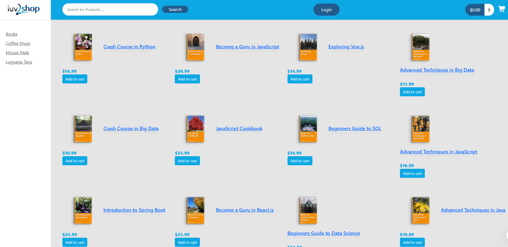
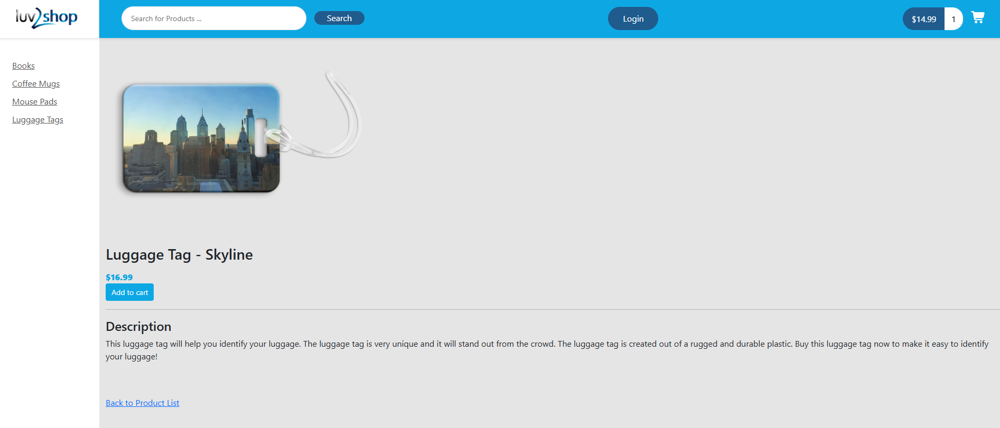
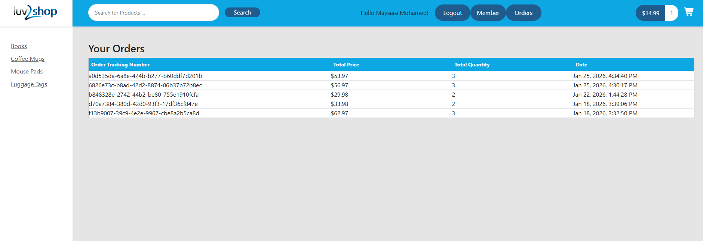

# Full Stack E-Commerce Application

A full-stack e-commerce web application built with Angular and Spring Boot, featuring product browsing, shopping cart, secure checkout with Stripe payment integration, and user authentication using Auth0.

## Features

- Product catalog with category filtering and search functionality
- Shopping cart management with real-time updates
- Secure user authentication and authorization (Auth0)
- Order checkout with Stripe payment processing
- Order history tracking for registered users
- Responsive design for mobile and desktop

## Technologies Used

### Frontend
- Angular 19
- TypeScript
- Bootstrap / ng-bootstrap
- RxJS

### Backend
- Spring Boot 3
- Spring Data JPA
- Spring Security with OAuth2
- PostgreSQL
- Stripe API

## Screenshots

### Landing Page


### Product Details


### login


### products



## Prerequisites

- Node.js (v18 or higher)
- Angular CLI
- Java 17 or higher
- PostgreSQL
- Auth0 account
- Stripe account

## Setup Instructions

### Database Setup

1. Create a PostgreSQL database named `full_stack_ecommerce`
2. Run the database schema scripts located in the `database` folder

### Backend Setup

1. Navigate to the `spring-boot-ecommerce` directory
2. Copy `src/main/resources/application.properties.template` to `application.properties`
3. Update the following properties:
   - Database credentials
   - Auth0 configuration (domain, client ID, client secret, audience)
   - Stripe secret key
4. Run the application:
   ```bash
   ./mvnw spring-boot:run
   ```

### Frontend Setup

1. Navigate to the `angular-ecommerce` directory
2. Install dependencies:
   ```bash
   npm install
   ```
3. Copy `src/environments/environment.template.ts` to `environment.ts`
4. Update the environment file with:
   - Auth0 configuration
   - Stripe publishable key
5. Run the application:
   ```bash
   ng serve
   ```
6. Open browser at `http://localhost:4200`

## API Endpoints

- `GET /api/products` - Get all products
- `GET /api/product-category` - Get product categories
- `GET /api/countries` - Get countries for checkout
- `GET /api/states` - Get states by country
- `POST /api/checkout/purchase` - Place an order (protected)
- `POST /api/checkout/payment-intent` - Create Stripe payment intent (protected)
- `GET /api/orders` - Get order history (protected)

## Authentication

This application uses Auth0 for authentication. Protected routes require a valid JWT token. The following endpoints are protected:
- `/api/orders/**`
- `/checkout` (frontend)
- `/members` (frontend)
- `/order-history` (frontend)

## Payment Processing

Stripe is integrated for secure payment processing. Test card numbers can be used in development mode:
- Card number: 4242 4242 4242 4242
- Any future expiration date
- Any 3-digit CVC

## Project Structure

```
├── angular-ecommerce/          # Frontend Angular application
│   ├── src/
│   │   ├── app/
│   │   │   ├── components/     # Angular components
│   │   │   ├── services/       # Angular services
│   │   │   ├── common/         # Model classes
│   │   │   └── validators/     # Custom validators
│   │   └── environments/       # Environment configurations
│
└── spring-boot-ecommerce/      # Backend Spring Boot application
    ├── src/
    │   ├── main/
    │   │   ├── java/
    │   │   │   └── com/udemy/ecommerce/
    │   │   │       ├── config/         # Security and CORS config
    │   │   │       ├── controller/     # REST controllers
    │   │   │       ├── dto/            # Data transfer objects
    │   │   │       ├── entity/         # JPA entities
    │   │   │       ├── repository/     # JPA repositories
    │   │   │       └── service/        # Business logic
    │   │   └── resources/
    │   │       └── application.properties
```

## License

This project is for educational purposes.